@(Rudy's Notebook)[infinity, nodejs]

[toc]

# Infinity-Kernel

Infinity-Kernel is the one and only kernel module of Infinity Platform, a pure java modular system that can used as core platform of small applications, enterprise applications, middle-wares, event embedded in an existing application or other middle-wares.

## Last release

The current stable release  is v8.0.0.2.

## Prerequisites

- JDK 1.7.0 or JDK 1.8.0

## Preparation

To clone the Infinity-Kernel

```bash
git clone https://github.com/infinity-platform/infinity-kernel.git -b v8.0.0.2
```

Before starting anything further, the environment variable `INFINITY_KERNEL_BASE` must be setting to the directory of local repository that **Infinity-Kernel** cloned into.

For Unix like systems,

```bash
export INFINITY_KERNEL_BASE=<PATH-TO-THE-LOCAL-REPOSITORY-OF-INFINITY-KERNEL>
```

For Windows,

```dos
set INFINITY_KERNEL_BASE=<PATH-TO-THE-LOCAL-REPOSITORY-OF-INFINITY-KERNEL>
```

You have to place this environment variable setting in **Global** scope environment settings, like **System-Wide** environment variables do, or **Local** scope environment that **Eclipse** or **maven** runs in.

After `INFINITY_KERNEL_BASE` environment variable is ready to use, Runtime environment of **Infinity-Kernel** needs to be built before using it. Switch to the local repository of **Infinity-Kernel** and do the following task:

For Unix like systems,

```bash
cd $INFINITY_KERNEL_BASE
cd infinity-kernel
mvn clean package
```

For Windows,

```dos
cd %INFINITY_KERNEL_BASE%
cd infinity-kernel
mvn clean package
```

If everything done successfully, you are ready to setting up development and runtime environment.

## Setting up development environment

Now, import the `infinity-kernel` project into Eclipse by switching to **"Git"** perspective, click **"Add an existing local Git repository"**


Selecting **".../infinity-kernel"**,  which is cloned using git clone command previously, then click **"Finish"**.


Switching back to **"Java"** perspective, select **"Import..."** by right clicking on **"Package Explorer"** view.


Expanding **"Git"** Folder, click **"Next >"** after selecting **"Projects from Git"**


Selecting **"Existing local repository"**, then click **"Next >"**.


Selecting **"infinity-kernel"**, then click **"Next >"**.


Default selection is perfect, just click **"Next >"**.


Make sure **"infinity-kernel"** project is checked, click **"Finish"** to import project now.


Back to **"Java"** perspective, if seeing **"infinity-kernel"** in **"Package Explorer"** view without any error, all things done.


That's it, now you have a **Infinity-Kernel** environment, which is ready to run. Plus, you can starting developing and running your modules with it, too.

## Start the Infinity-Kernel

You can test the **Infinity-Kernel** runtime by starting it in Eclipse. There is a pre-configured launch setting already build in the **infinity-kernel** project root directory, called `run-nodeagent-990x.launch`. 

Open this file by double click it. Replacing string **"STANDALONG"** with **"SERVER"** and save it.


To launch the **Infinity-Kernel** runtime, right click on that file, selecting **"Run As"**, than **"run-nodeagent-990x"**


If **"Console"** view shows log like following, **Infinity-Kernel** starts successfully.


You can check the [JMX console](http://localhost:9902/) to see more information about the running instance by open URL http://localhost:9902/ in any browser.


Default user is `mnmadmin` and password is also `mnmadmin`


## Creating your first module

### Setup `INFINITY_RUNTIME_BASE`

Before you can develop the first module, there is a environment variable has better to be defined for enabling **Auto-Deploying-to-Runtime** feature, which is `INFINITY_RUNTIME_BASE`. This variable must pointing to the working directory of **Infinity-Kernel** runtime instance, which is `$INFINITY_KERNEL_BASE/infinity-kernel/build/setup` by default. Eclipse must restart for this environment variable to take effect.

For Unix like systems,

```bash
export INFINITY_RUNTIME_BASE=$INFINITY_KERNEL_BASE/infinity-kernel/build/setup
```

For Windows,

```dos
set INFINITY_RUNTIME_BASE=%INFINITY_KERNEL_BASE%/infinity-kernel/build/setup
```

### Setup archetype settings

The easiest way to creating a new module for **Infinity-Platform** or **Infinity-Kernel** is using `pojomodule` archetype, the full name is `infinity-module-pojomodule-archetype` in maven's perspective. Please follow the procedure below to set it up.

In Eclipse, open the **"Preferences..."** window, expends **"Maven"**,  and select **"Archetypes"** item.

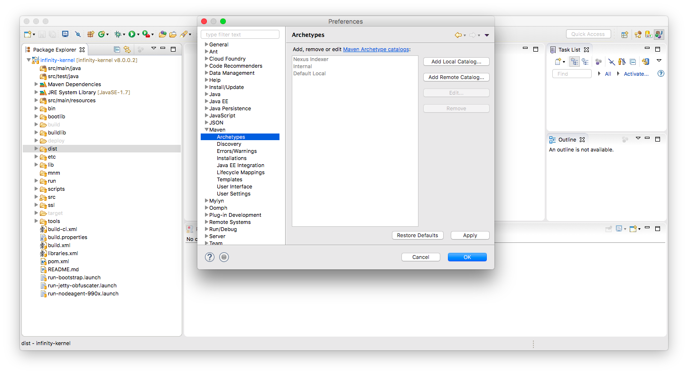

Click the **"Add Remote Catalog..."** button on the right.

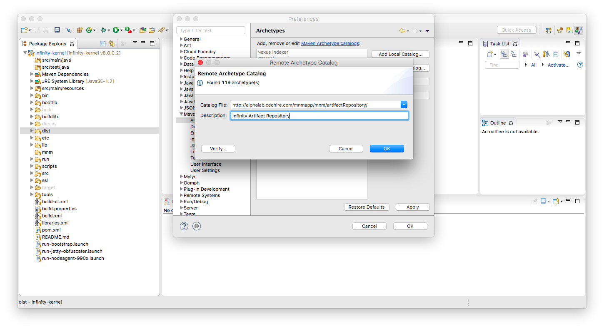

In the **"Catalog File:"** field, enter the URL "[http://alphalab.cechire.com/mnmapp/mnm/artifactRepository/](http://alphalab.cechire.com/mnmapp/mnm/artifactRepository/)", which is the official site of **Infinity Artifact Repository**.

In the **"Description:"** field, enter the name **"Infinity Artifact Repository"**. Click **"Finish"** button to save settings.

### Create a new module, called "First Module"

Now, you are ready to create the first module. Back to **"Java"** perspective, right click on **"Package Explorer"** view, and select **"New"**, and **"Project..."** item. In **"New Project"** window, expand **"Maven"**, select **"Maven Project"** and click **"Next >"** button.

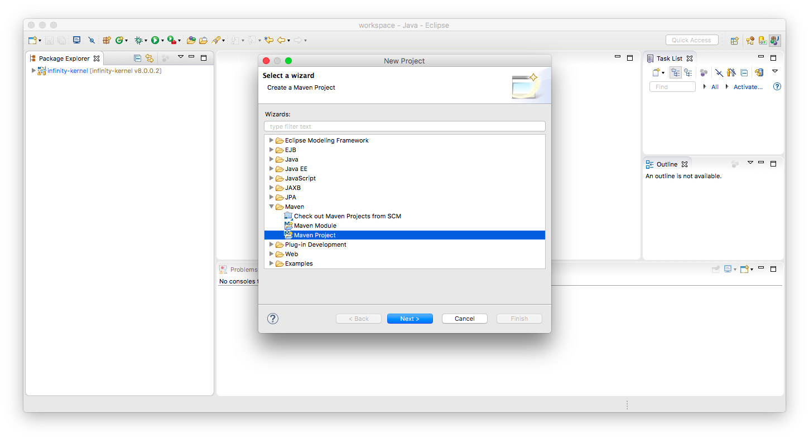

Click **"Next >"** button to skip this page if everything is ok.

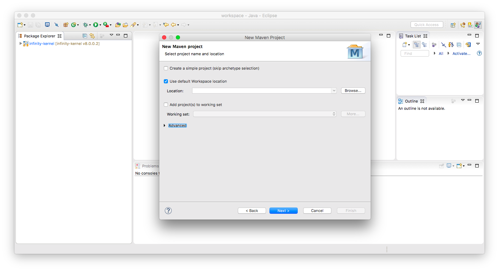

In the **"Select an archetype"** page, select **"infinity-module-pojomodule-archetype"** and click **"Next >"**.

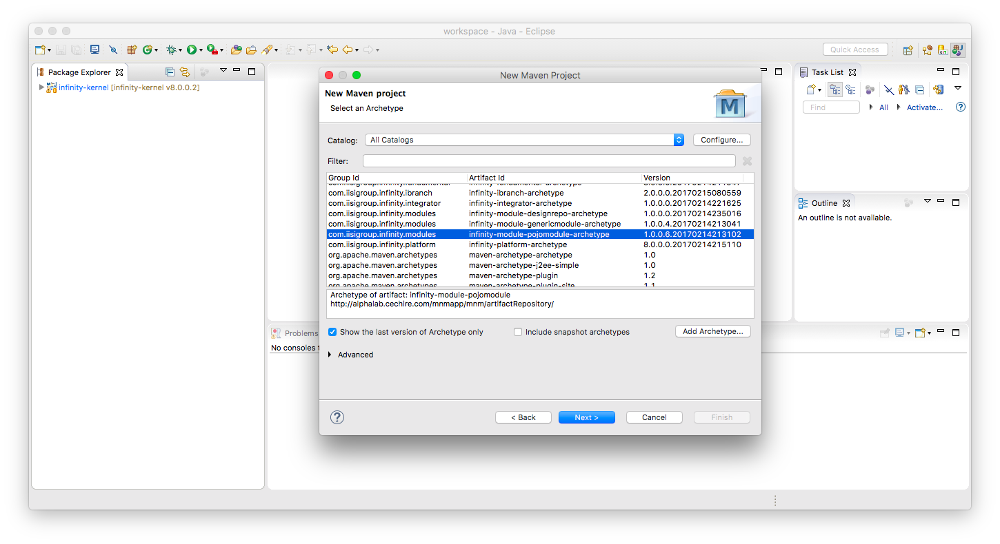

In this page, you have to enter the following information of your new module,

***Group Id*** is the group name of artifact, usually you can fill with the **Package Name** of the new module or classes. By following conventions, use only lower case characters and digits, and use dot as separators.

***Artifact Id*** is the name of artifact, usually you can fill with the **Project Name** of the new module. By following conventions, use only lower case characters and digits, and use underline as separators.

***Version*** is the initial version number of the new module, usually 1.0.0.0 is just fine. By following conventions, use only digits and use dot as separators, best have four parts of the version number.

***Package*** is the package name of the new module, usually it is the same with **"Group Id"**.
> **One thing to remind**: when typing in **"Artifact Id"** field, the **"Package"** will also changed at the same time. Please do not forget to modify the value back to be the same with **"Group Id"**.

***moduleName*** is the name of the new module. Please follow **UpperCamelCase**  convention.

***moduleCodeName*** is the code name of the new module, usually it is all lower case of **moduleName** , which is used in the middle of package name, module directory name, module id in configuration files.

***moduleInstanceName*** is the instance name of the new module, usually it is the same string that follows **"lowerCamelCase"** of **moduleName**, and used in module's **ObjectName**.

Take this **"First Module"** for example, those values will be filled like following screenshot:

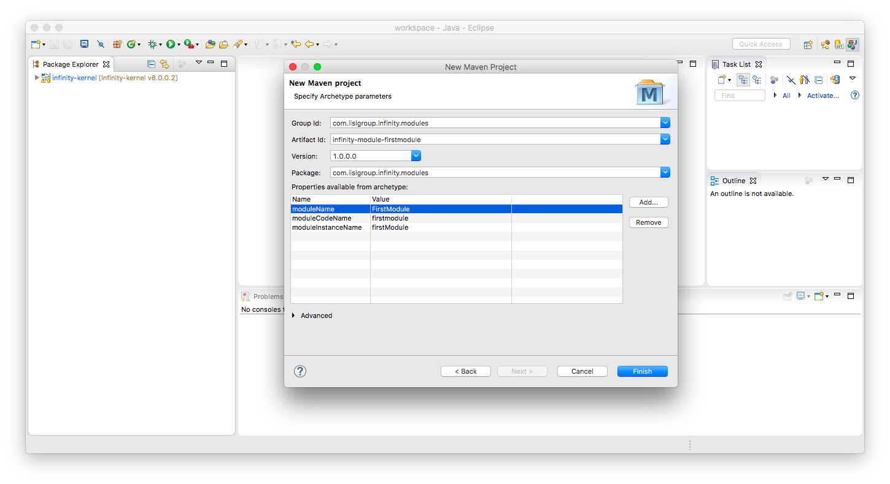

After click **"Finish"**, the new module project **"infinity-module-firstmodule"** is created.

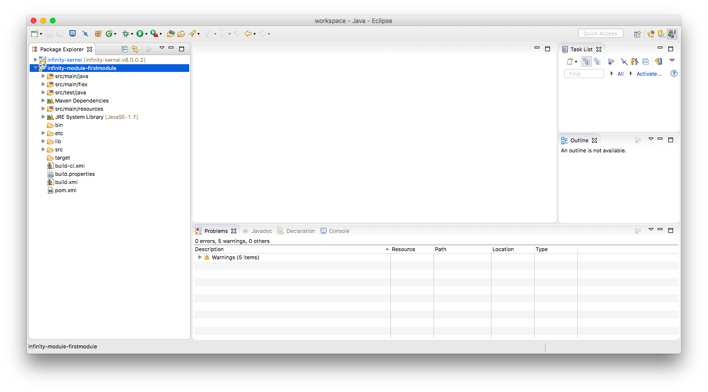

Normally, newly created module project will have no error. If your project has one or more errors, it could cause by maven haven't refresh correctly. Usually, following action can fix it. 

Right click on the project name, select **"Maven"**, then **"Update Project..."** 

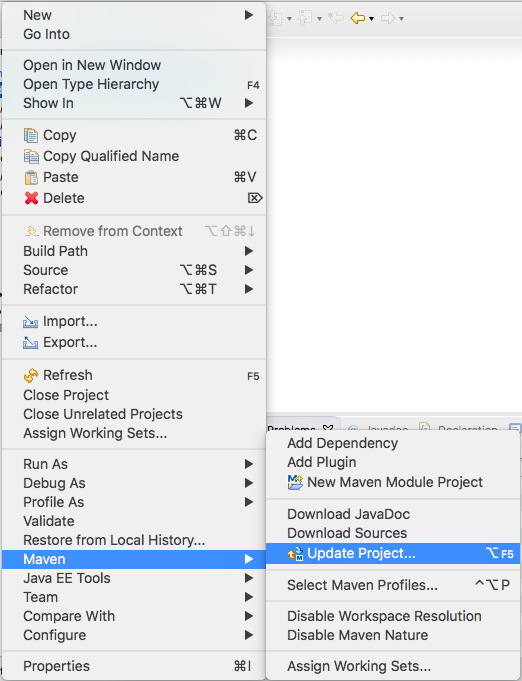

When following window shows up, click **"Ok"**. Maven will update internal cached information and make Eclipse rebuilds this project.

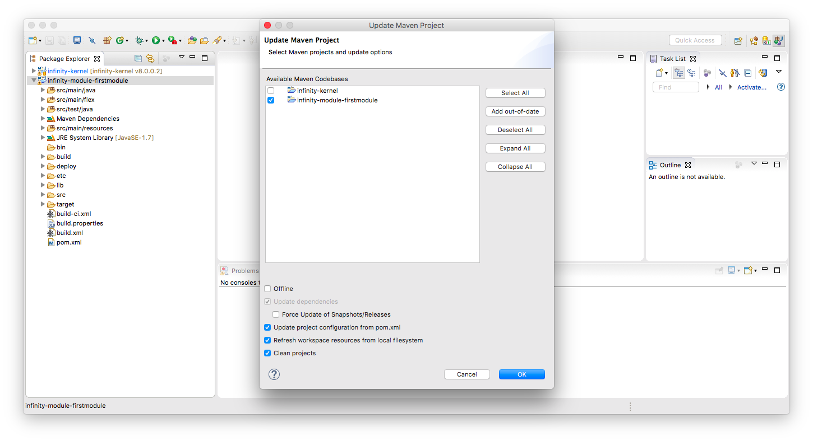

### Build and run the "First Module"

Every module project created by **pojomodule** archetype is trivial but ready to run. It contains a sample method `hello`.  As the first sample, make it simple is good. So we first check how it works without changing anything. Now you need to build this module before running it. 

Expands the project, right click on the `build.xml`,  select **"Run As"**, then **"Ant Build"**. After the build procedure done, it will create a `deploy` folder, which contains generated **\*.jar** files and packaged **\*.mnm** file.

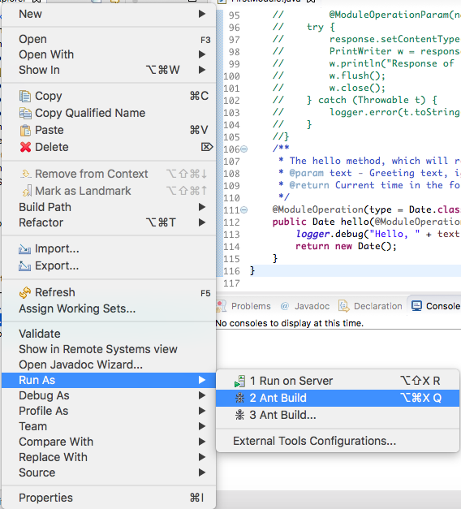

Additionally, because we have enabled **Auto-Deploying-to-Runtime** previously, so build procedure will deploy the packaged module file to runtime automatically. If the **Infinity-Kernel** is still running, you can see the server will discover the newly deployed module, initiating, registering, and finally starting it through the console log. If the **Infinity-Kernel** is not running, just starts it, and you will see above procedure in the console log, too.  

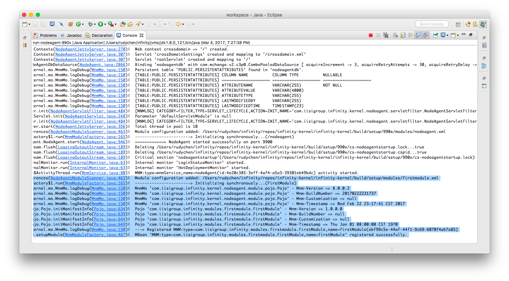

### Exam the `hello` method

Now we can check how the `hello` method work by opening a browser connect to [JMX Console](http://localhost:9902/) ([http://localhost:9902/](http://localhost:9902/)). Use `mnmadmin` as user and password in authentication window shows up. Search the instance name of module **"firstModule"** in the **"Server View"**.

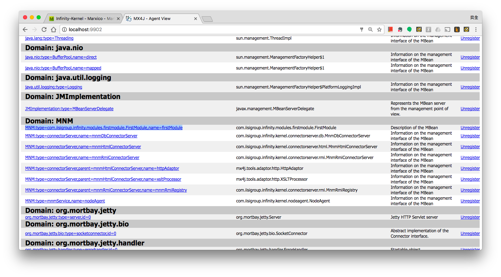

Enter the module's detail view by clicking the link [MNM:type=com.iisigroup.infinity.modules.firstmodule.FirstModule,name=firstModule](http://localhost:9902/mbean?objectname=MNM%3Atype%3Dcom.iisigroup.infinity.modules.firstmodule.FirstModule%2Cname%3DfirstModule)

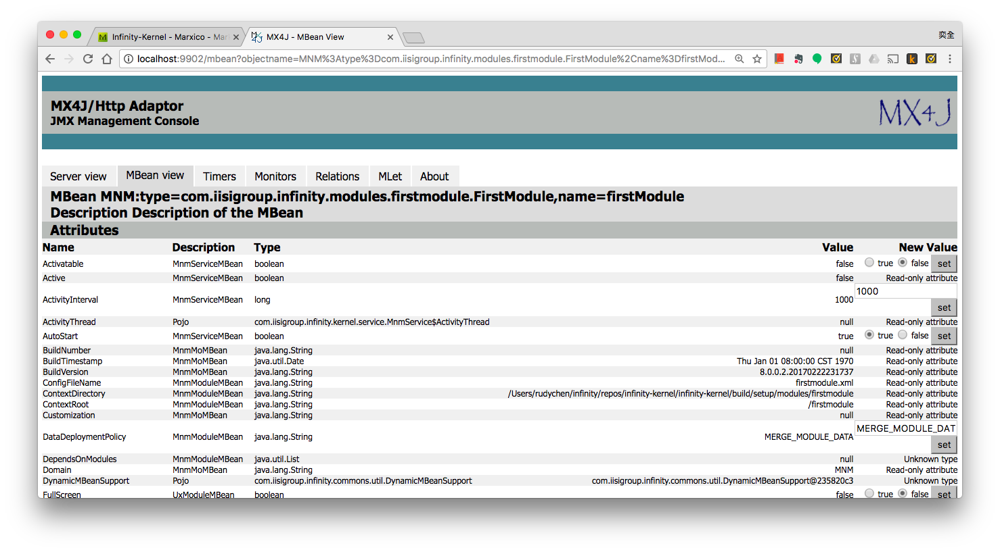

Jump to the **"Operations"** section, scroll down this page, you will find `hello` method.


You can type text in the input field, in this example we type "World", then click **"Invoke"** button. The result of the invoke action will look like following, the current time returns.

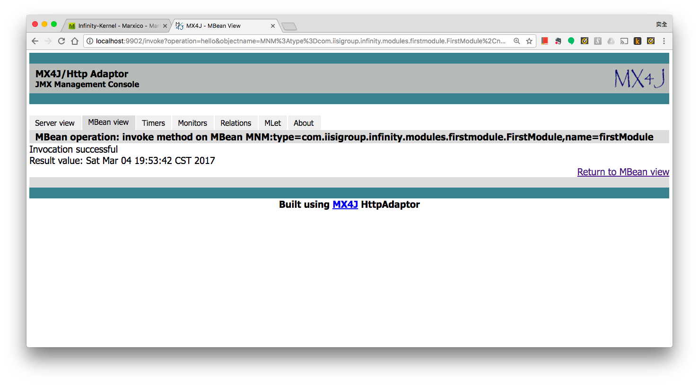

Now switch to **"Console"** view of Eclipse, you can see a log shows **"Hello, Word!"** in it.

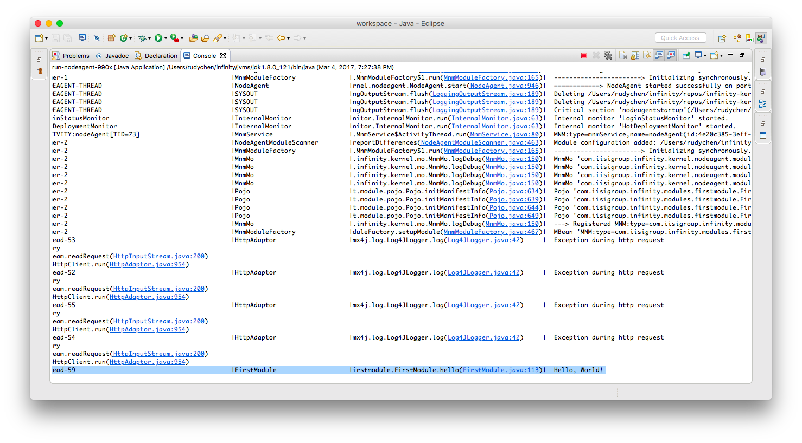

By checking the `hello` method code below:

```java
/**
 * The hello method, which will return a java.util.Date object indicating current time.
 * @param text - Greeting text, ignored.
 * @return Current time in the form of java.util.Date.
 */
@ModuleOperation(type = Date.class)
public Date hello(@ModuleOperationParam(name = "text", type = String.class) String text) {
    logger.debug("Hello, " + text + "!");
    return new Date();
}
```

What does `hello` really do is, first showing a string "Hello, ...!" in log, second returning current time with a `java.util.Date` object. These two actions reflect the same things as we see in browser and console log.

That it, what `hello` method tells us is: a **public**  method of module can be treat as a **MBean Operation**. Any one can invoke that operation through any **JMX** way. Actually, every module of **Infinity-Platform** or **Infinity-Kernel** is a **MBean**, or more precisely, a **Dynamic MBean**. ***Every public property is a attribute of MBean, every public method is a operation of MBean***.

According to JMX spec, operations and attributes can be accessed using JMX APIs inside a JVM, or JMX/RMI protocol remotely from another JVM. But an **Infinity Module** can do more than that! Actually, an **Infinity Module** is not just a MBean, but also a **WebApp**, a **Servlet**, a **WebService Provider** by default. More precisely, **Infinity Module** is a self-contain, independent software component that can be used as various kinds of functions at the same time. We will take a deeper look at the module and how it can be used in the following sections.

--------------
*(To be continued)*