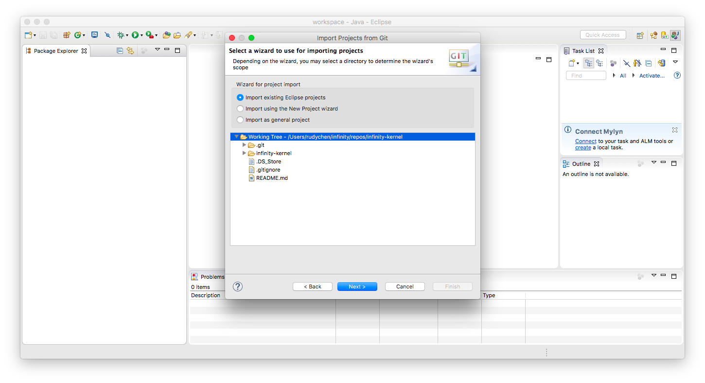

@(Rudy's Notebook)[infinity, nodejs]

# Infinity-Kernel

Infinity-Kernel is the one and only kernel module of Infinity Platform, a pure java modular system that can used as core platform of small applications, enterprise applications, middle-wares, event embedded in an existing application or other middle-wares.

## Last release

The current stable release  is v8.0.0.2.

## Prerequisites

- JDK 1.7.0 or JDK 1.8.0

## Preparation

To clone the Infinity-Kernel

```bash
git clone https://github.com/infinity-platform/infinity-kernel.git -b v8.0.0.2
```

Before starting anything further, the environment variable `INFINITY_KERNEL_BASE` must be setting to the directory of local repository that **Infinity-Kernel** cloned into.

For Unix like systems,

```bash
export INFINITY_KERNEL_BASE=<PATH-TO-THE-LOCAL-REPOSITORY-OF-INFINITY-KERNEL>
```

For Windows,

```dos
set INFINITY_KERNEL_BASE=<PATH-TO-THE-LOCAL-REPOSITORY-OF-INFINITY-KERNEL>
```

You have to place this environment variable setting in **Global** scope environment settings, like **System-Wide** environment variables do, or **Local** scope environment that **Eclipse** or **maven** runs in.

After `INFINITY_KERNEL_BASE` environment variable is ready to use, Runtime environment of **Infinity-Kernel** needs to be built before using it. Switch to the local repository of **Infinity-Kernel** and do the following task:

For Unix like systems,

```bash
cd $INFINITY_KERNEL_BASE
cd infinity-kernel
mvn clean package
```

For Windows,

```dos
cd %INFINITY_KERNEL_BASE%
cd infinity-kernel
mvn clean package
```

If everything done successfully, you are ready to setting up development and runtime environment.

## Setting up development environment

Now, import the `infinity-kernel` project into Eclipse by switching to **"Git"** perspective, click **"Add an existing local Git repository"**


Selecting **".../infinity-kernel"**,  which is cloned using git clone command previously, then click **"Finish"**.


Switching back to **"Java"** perspective, select **"Import..."** by right clicking on **"Package Explorer"** view.


Expanding **"Git"** Folder, click **"Next >"** after selecting **"Projects from Git"**


Selecting **"Existing local repository"**, then click **"Next >"**.


Selecting **"infinity-kernel"**, then click **"Next >"**.


Default selection is perfect, just click **"Next >"**.



Make sure **"infinity-kernel"** project is checked, click **"Finish"** to import project now.


Back to **"Java"** perspective, if seeing **"infinity-kernel"** in **"Package Explorer"** view without any error, all things done.


That's it, now you have a **Infinity-Kernel** environment, which is ready to run. Plus, you can starting developing and running your modules with it, too.

## Start the Infinity-Kernel

You can test the **Infinity-Kernel** runtime by starting it in Eclipse. There is a pre-configured launch setting already build in the **infinity-kernel** project root directory, called `run-nodeagent-990x.launch`. 

Open this file by double click it. Replacing string **"STANDALONG"** with **"SERVER"** and save it.


To launch the **Infinity-Kernel** runtime, right click on that file, selecting **"Run As"**, than **"run-nodeagent-990x"**


If **"Console"** view shows log like following, **Infinity-Kernel** starts successfully.


You can check the [JMX console](http://localhost:9902/) to see more information about the running instance by open URL http://localhost:9902/ in any browser.


Default user is `mnmadmin` and password is also `mnmadmin`


